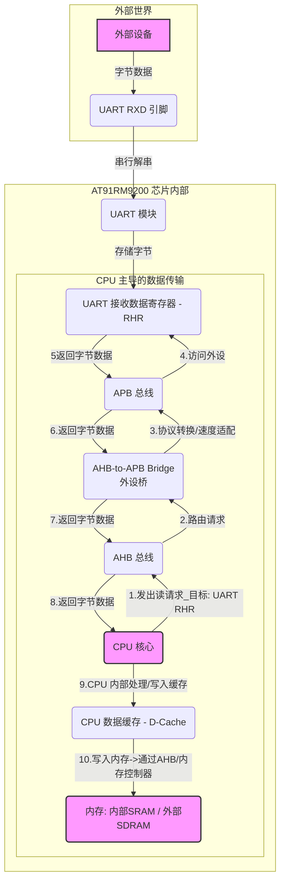

```mermaid
graph TD
    subgraph 外部世界
        A[外部设备] -- 字节数据 --> B(UART RXD 引脚)
    end

    subgraph AT91RM9200 芯片内部
        B -- 串行解串 --> C(UART 模块)
        C -- 存储字节 --> D(UART 接收数据寄存器 - RHR)

        subgraph CPU 主导的数据传输
            E(CPU 核心) -- 1.发出读请求_目标: UART RHR --> F(AHB 总线)
            F -- 2.路由请求 --> G(AHB-to-APB Bridge<br>外设桥)
            G -- 3.协议转换/速度适配 --> H(APB 总线)
            H -- 4.访问外设 --> D
            D -- 5返回字节数据 --> H
            H -- 6.返回字节数据 --> G
            G -- 7.返回字节数据 --> F
            F -- 8.返回字节数据 --> E
            E -- 9.CPU 内部处理/写入缓存 --> I(CPU 数据缓存 - D-Cache)
            I -- 10.写入内存->通过AHB/内存控制器 --> J(内存: 内部SRAM / 外部SDRAM)
        end
    end
    
    style A fill:#f9f,stroke:#333,stroke-width:2px
    style E fill:#f9f,stroke:#333,stroke-width:2px
    style J fill:#f9f,stroke:#333,stroke-width:2px
```

